<!--
  Once you have a portrait (see scripts/make_portrait.py), uncomment this
  line and it will sit to the left of the stats, matching the layout at
  github.com/andriidrok1:

  
-->

[portfolio](https://tksluangrath.github.io/) &nbsp;·&nbsp;
[linkedin](https://www.linkedin.com/in/TerranceLuangrath) &nbsp;·&nbsp;
[email](mailto:tksluangrath@gmail.com)

> Data scientist who likes solving real problems with machine learning 
> and statistics.

I hold an M.S. in Data Science from UVA (August 2026) and a B.S. in 
Applied Mathematics from James Madison University. My work spans machine 
learning, statistical modeling, and fraud detection, with a recent focus 
on deep learning for audio classification. Outside of data science, I 
breakdance — there's something satisfying about both finding patterns in 
datasets and nailing a new move.

<samp>python &nbsp; r &nbsp; sql &nbsp; sas &nbsp; latex &nbsp; pandas &nbsp; numpy &nbsp; scikit-learn &nbsp; pytorch &nbsp; matplotlib &nbsp; fastapi &nbsp; git &nbsp; jupyter &nbsp; azure</samp>

**[llm-cost-carbon](https://github.com/tksluangrath/llm-cost-carbon)** &nbsp;·&nbsp; <samp>python, mcp</samp> 
MCP server that answers what an LLM call actually cost, reconciling 
ccusage-captured usage logs from Claude Code, Codex, OpenCode, and Amp. 
Local-only: no proxy, no cloud infrastructure, no telemetry.

**[Frequency-Based Speech Isolation for Keyword Spotting](https://github.com/tksluangrath/ds6050-audio-projects)** &nbsp;·&nbsp; <samp>python, pytorch</samp> 
CNN vs. Audio Spectrogram Transformer for keyword spotting under noisy 
conditions, tested across three preprocessing strategies and five SNR 
levels. The CNN won every configuration (93.42% clean, 81.94% at -5 dB 
with bandpass filtering).

**[Fraud Detection ML Pipeline](https://github.com/tksluangrath/fraud-detection-app)** &nbsp;·&nbsp; <samp>python, azure</samp> 
Trained on 6.3M+ PaySim transactions, 94% recall and 0.99 ROC-AUC on a 
severely imbalanced dataset (0.13% fraud). Shared train/serve pipeline on 
Azure ML and Container Apps, so the deployed model always matches what 
was validated in training.

**[AURA-ED](https://github.com/XinnieMai/AURA-ED)** &nbsp;·&nbsp; <samp>python, llm</samp> 
Clinical decision-support tool that synthesizes fragmented ED patient data 
into structured early risk profiles, built on the Stanford MC-MED dataset 
(118,385 adult ED visits).

**[Oregon Trail Fitness](https://github.com/RichyKim12/Gold-Rush-Fitness)** &nbsp;·&nbsp; <samp>fastapi, healthkit</samp> 
Built at HoosHack 2026. An Oregon Trail-themed iOS fitness tracker pulling 
real step data from Apple HealthKit. I built the FastAPI backend and the 
HealthKit integration.

